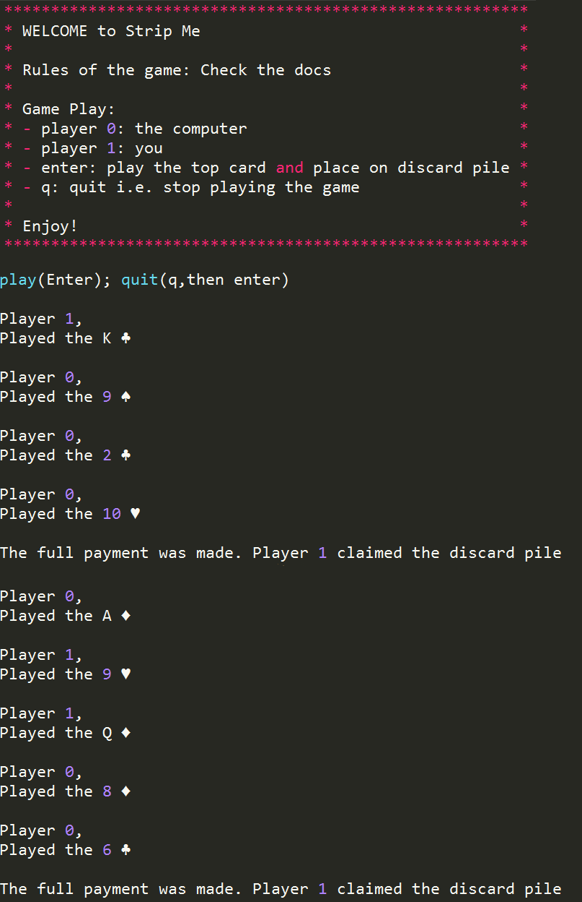

# Strip Me - CardGame

## About the game

All that is required is a full deck of playing cards, i.e. a pack of 52 playing cards. The deck of cards is divided among the players. There must be at least 2 players for this game. An even number of players results in an even distribution of cards, an odd number of players results in one player having 1 card greater than the others. The version that you will be developing will be a 2 player game, you versus the computer.

For a 2 player game, each player will therefore be dealt 26 cards. Like many other games, the deck of cards should be shuffled before the start of the game. Each player holds their hand of cards face down, players do not see what card they will play next. A play occurs when a player removes the top card of their hand and places it face up at the top of a discard pile. Players can only ever see the top card of the discard pile.

There are 2 groups of cards, pay cards and ordinary cards. Pay cards are Jacks, Queens, Kings, Aces. All other cards are ordinary cards. Suits do not matter. Play continues alternately until a pay card appears on the discard pile. The opponent of the person who played the pay card must pay for it by playing several times in succession. The payment rates are as follows,
* 4 ordinary cards for an ace
* 3 ordinary cards for a king
* 2 ordinary cards for a queen
* 1 ordinary card for a jack. 

When the payment is completed the person who played the pay card takes the entire discard pile and adds it face down to the bottom of their hand. If a pay card appears while a player is making a payment, the previous pay card is canceled and the opponent now has to pay for this new pay card. This continues until a payment is completed by one of the players. The player who first runs out of cards loses. 

## Requirements
python 3.x

## Usage
```
python stripMe.py
```
## Preview

